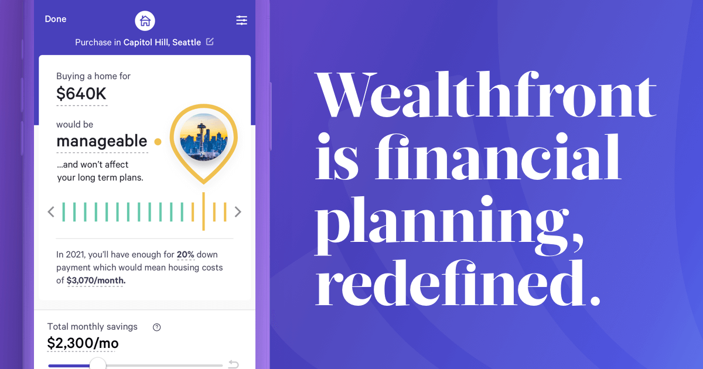

# Wealthfront (Robo Advisor)

## Overview

Wealthfront is an automated investment firm that works as a robo-advisor. Their software offers a computer based algorthmic trading platform as well as automated financial planning tools to find the best possible investment decisions to help customers achieve better financial outcomes. The company was founded by Rachleff who is currently the CEO in 2008. The company started as a tax-loss harvester for accounts with $100,000 or more and slowly transitioned in different financial avenues. Wealthfront had recieved a total funding of $65.5 million in 2014 by investments from Benchmark Capital, DAG Ventures, Index Ventures and other wealthy individuals. Wealthfront is based in Palo Alto, California and currently has about $20 billion assets under management. Wealthfron was rated as Top 10 Best Robo Advisors in 2020 by Business Insider.

### Business Activities

Wealthfront is trying to make their software and services available for the everyday investor by reducing the amount of management fees. They are currently have are tied with Betterment, another Robo Advisor, with a management fee of 0.25%. The type of investors they are trying to lure are new and experienced investors that want predictive and emotionless financial advice unlike a traditional investment manager that has emotional trading/investment advice. Wealthfront appeals to investors that are interested in automated investment management and want helpful investment tools such as tax optimized strategies, automatic portfolio rebalancing and robust finanical planning tools. One of the main technologies that Wealthfront uses is the application of machine learning such as algorthmic trading to beat traditional investors/human investing. They also use data analytics in order to analyze market trends to keep their investment strategies current.

#### Financial Landscape

Wealthfront plays a big role in the current FinTech industry, with a focus on robo-advising and personal finance. They also have a hint of digital banking since they offer lending/borrowing of capital for investment portfolios. The most obivous trend is now that this Robo-Advising/Personal Finance space has been around for about 10 years and they have been accumulating more and more data to make their products and services more accurate and user-friendly. Another trend has been that this industry has been innovating by reaching different streams of the investment market outside the traditional stock market such as alternative finance, private real estate, infrastructure investment, and other asset classes. As more time goes on, more investment strategies and different investment types can be implented. Another move that the industry has been trending toward is lower management fees that compete with big traditional investment firms. Thus, squeezing traditional investors to steer away creating opportunity to lower account fees. 

Creating efficiency, effectiveness and cheaper alternatives has been the goal for Robo Advisors and it seems to be a growing trned in younger investors. Wealthfront has many competitors in their industry. The biggest competitors are SoFi and Betterment. Betterment is a robo advisor that has the same management fee (0.25%) as Wealthfront but has an account minimum of $0 compared to Wealthfront's $500. SoFI has a 0% management fee relative to Wealthfront's 0.25% fee and also has a $0 account minimum.

##### Results and Recommendations

Wealthfront seems to growing as the robo advising landscape is trending. They have grown from $97 million assets under management in 2013 to $20 billion in 2019. To examine that a bit more, in Janaury of 2019 the company had $11.4 billion AUM, an expontential growth in the same year. Since the industry is relatively new, the metrics that the industry can look at his the growth in assets under management year-over-year to see their customer retention and diversification in investment types. The winner of this industry gains and retains the most amount of people by making it more accessible, lowest account fees to attract investors and diversfying their investment types/tools.

If I could recommend any advice to the company is decrease the account minimum to compete with their competitors standards and keep educating the everyday investor that the technologies that the company is using is trustworthy and accurate compared to the traditional financial advisor. The company needs to keep offering more products and services because that is what customers are accustomed to with traditional banks/investment managers/financial advisors. By doing so, the company and the industry can compete with traditional financial managers. 

